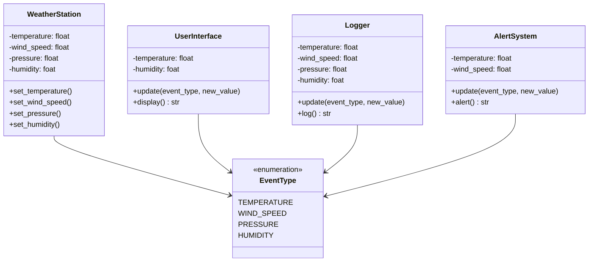
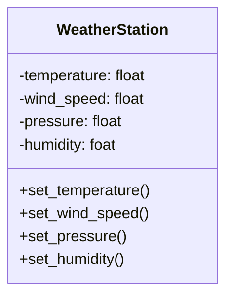
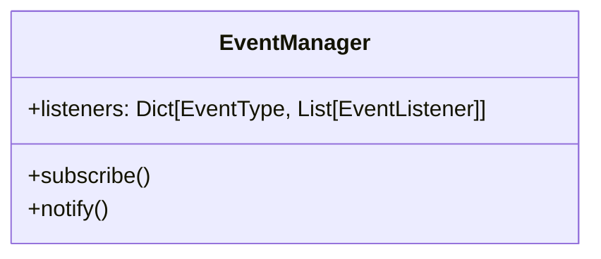
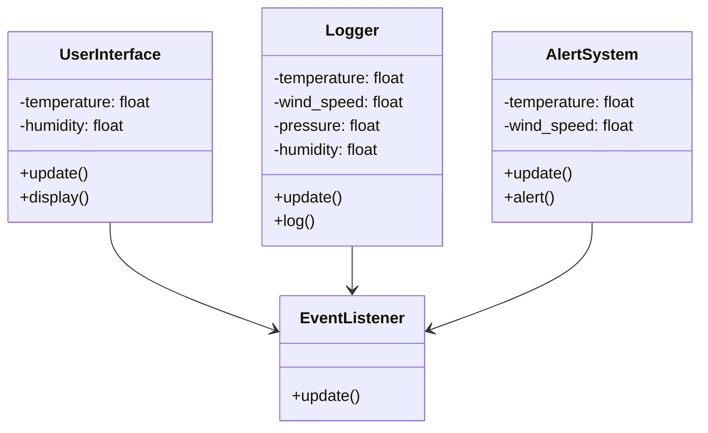
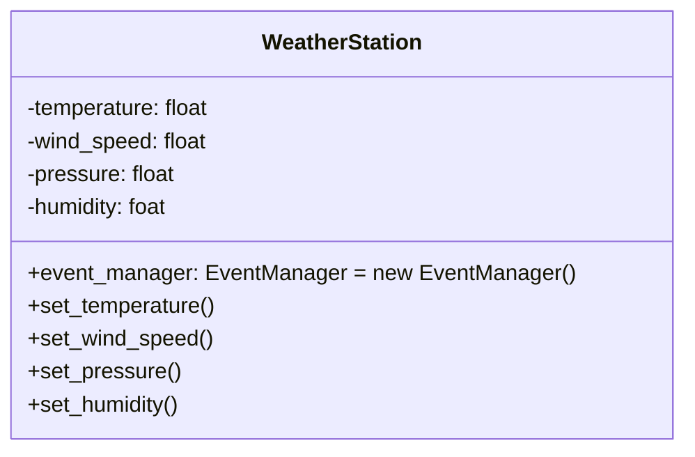
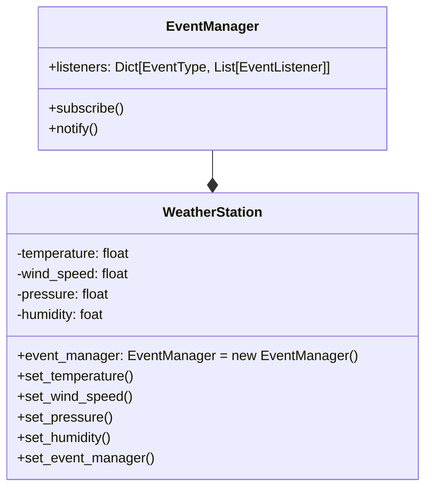
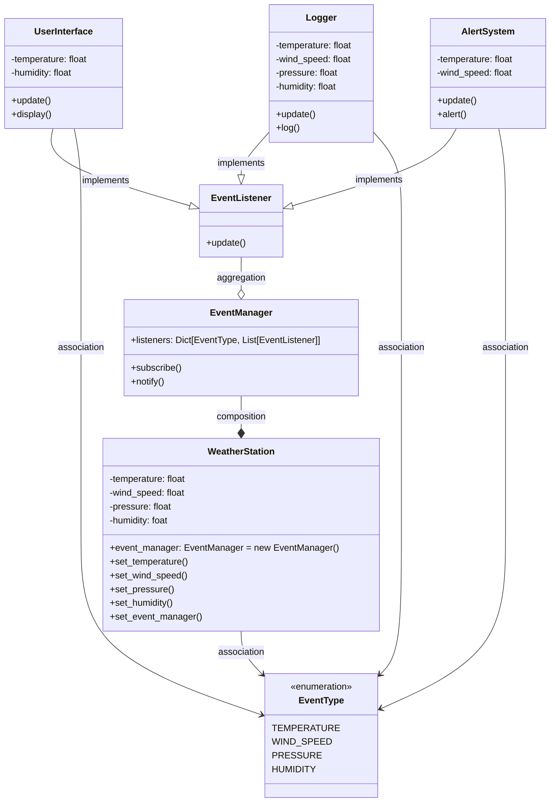

# Observer Pattern

The observer pattern is a behavioral design pattern that defines a one-to-many dependency between objects so that when one object changes state, all its dependents are notified and updated automatically.

## Problem

You are working on a `WeatherStation` class that records data from sensors from a weather station. You are building a web application that listens to events, and updates the `temperature`, `wind_speed`, `pressure` and `humidity` parameters according to the values sensed by the weather station. It then outputs the new values in different formats, visually through the `UserInterface` class, in the form of logs through the `Logger` class and as alerts thanks to the `AlertSystem` class.

Implement the Observer pattern to satisfy the functional requirement described above and make sure that your solution is easily extensible for other subscribers.



## Solution

In order to implement, let's define an *Observable* class. The *Observable* class is the one that changes its attributes from time to time. In this case, such class is the *WeatherStation* classs.



Let's define the *Subject* Interface, that we will call *EventManager*. This Interface has the attiribute *listeners*, which has a list of *EvenetListener* instances subscribed to each EventType. On the other hand, it might have the `notify()` and `subscribe()` methods, as follows:



Also, let's define the *Observer* Interface, that we will call *EventListener*. On the other hand, it might have the `update()` method, as follows:



The *WeatherStation* class either implements or has a relationship by composition with the *EventManager*. The problem at hand uses composition. Then the *WeatherStation* class might include an attribute of type *EventManager* as follows:



The instance of *event_manager* in the *WeatherStatuion* will be in charge of notifying all the subscribed observers in the *listeners* attribute in *EventManager* class. Then the relationship between *WeatherStation* and *EventManager* should look as follows:



Inside the methods `set_temperature()` `set_wind_speed()` `set_pressure()` & `set_humidity()` the attribute *event_manager* notifies observers, for example:

```python
def set_temperature(self, new_value):
    self._temperature = new_value
    self.event_manager.notify(EventType.TEMPERATURE, new_value)
```

Then the WeatherStation App looks as follows:


