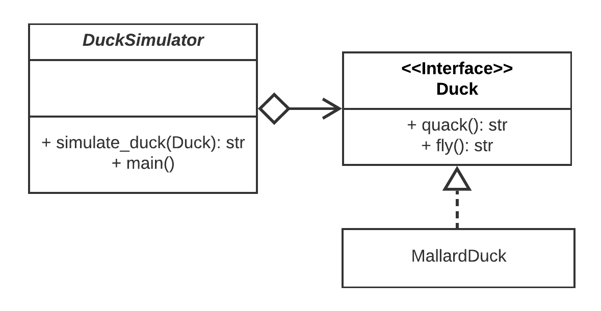
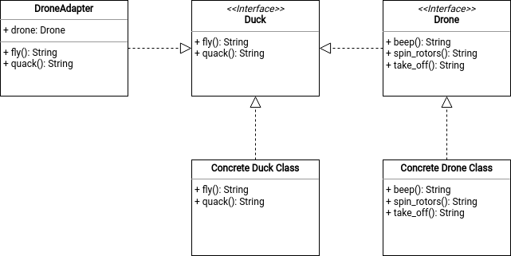

# Adapter Pattern

Adapter pattern is a structural pattern that allows objects with incompatible interfaces to collaborate.

## Problem

You are working on a [_DuckSimulator_](./main.py) class that implements the method `simulate_duck()`. This method receives objects of type [_Duck_](./ducks.py) as parameter.



There is a new type of objects called [_Drone_](./drones.py) which shares many similarities with the _Duck_ type. Extend the functionality of the _DuckSimulator_ class, to simulate objects of type _Drone_. Implement the class [_DroneAdapter_](./adapter.py) following the **Adapter Design Pattern**.


## Solution

Following the *Adapter Design Pattern*, the implemented code should not suffer any changes. Thus, a *Drone Adapter* should be created in order to pass a *Drone* as a *Duck* to the existing code.

### Class - Drone Adapter
This class might implement the existing *Duck Interface* and its methods. The image below show the implementation of the *Drone Adapter* class.



On one hand, the drone flying process consists of two steps:
- Spinning the rotors.
- Taking off.

The implementation of the current class might have both methods within the *fly()* method. Then, the method will return the concatenation of the two methods. On the other hand, the drone is not able to make the sound quack, but is able to beep. Then, the *quack()* method calls the *beep()* method of the drone.

```python
def quack(self) -> str:
    return self.drone.beep()

def fly(self) -> str:

    return self.drone.spin_rotors() + "\n" + self.drone.take_off()
```
### Duck Simulator
The image below shows the UML of the application at hand.


