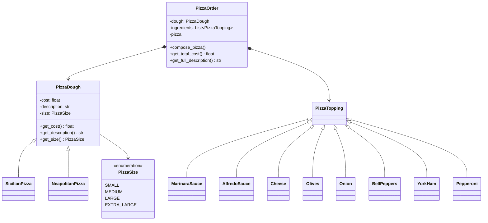
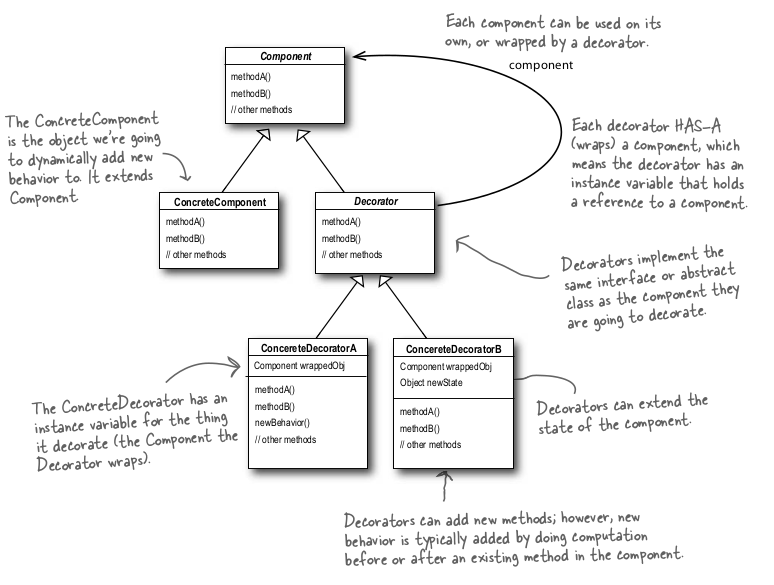
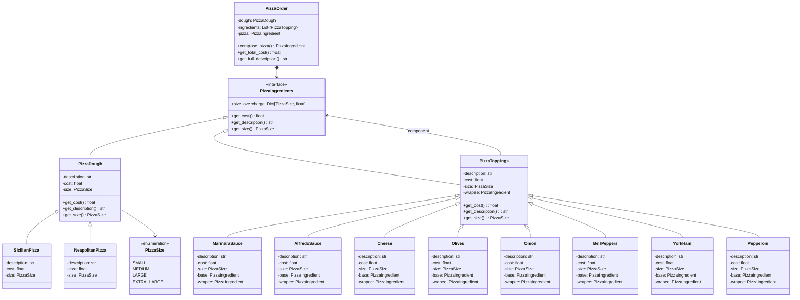

# Decorator Pattern

Decorator pattern is a structural pattern that allows adding new behaviors to objects dynamically by placing them inside special wrapper objects.

## Problem

You are working on the ordering system for a pizza restaurant. The client code will create the order by instantiating objects of the class `PizzaOrder`. This class should allow building the order by selecting a base `PizzaDough` and adding different `PizzaToppings` resulting in the description of the pizza that will be given to the kitchen staff, and the total cost to be charged to the final customer.

Here is an starter UML of the solution:



Use the Decorator Design Pattern to compose Pizza orders with arbitrary complex combination of toppings.

This is the expected return when running `python -m src.structural.decorator.main`:

```text
Small Neapolitan style pizza
+ Marinara sauce
+ Cheese serving
+ Pepperoni serving
+ Pepperoni serving
--------------------
Total cost: $19.00
```

## Solution

The solution is to create a `PizzaTopping` class that implements the `PizzaDough` interface. This class will have a reference to the `PizzaDough` object that it wraps. The `PizzaTopping` class will also have a method to add a new topping to the pizza. The `PizzaOrder` class will be modified to accept `PizzaTopping` objects as ingredients.

## 1. Writing the Pizza Order code
The pattern at hand attaches additional responsibilities to an object dynamically. Decorators provide a flexible alternative to subclassing for extending functionality. Thus, in order to apply the pattern to solve the problem at hand a *PizzaIngredient* interface (i.e. a Component). The component can be used on its own, or wrapped by a decorator. The actual implementation of the *PizzaIngredient* vary from *Doughs* to *Toppings* as follows:
- *Doughs* (i.e. a ConcreteComponent): implements the *PizzaIngredient* interface in order to dinamically add a new behaviour to it.
- *Toppings* (i.e. a Decorator): implements the *PizzaIngredient* interface and has an instance of the *PizzaIngredient* that holds a reference to it.

This can be explained further by the following class diagram.


*Source: Head First - Design Patterns*

## 2. Pizza Order UML
After applying the *Decorator Pattern*, the *Pizza Order UML* should look as follows:


